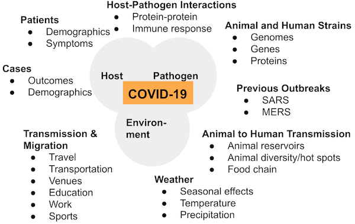

# Covid-19-Community

This project is a community effort to build a Neo4j Knowledge Graph (KG) that links heterogenous data about the COVID-19 to help fight this outbreak!

Join "GraphHackers, Let’s Unite to Help Save the World — [Graphs4Good 2020](https://medium.com/neo4j/graphhackers-lets-unite-to-help-save-the-world-graphs4good-2020-fed53562b41f)".

What kind of data can you contribute? Here are some ideas:



## How can you contribute?

* File an [issue](https://github.com/covid-19-net/covid-19-community/issues/new) to discuss your idea so we can coordinate efforts

* We need your help with [specific issues](https://github.com/covid-19-net/covid-19-community/labels/help%20wanted)
* Suggest publically accessible data sets
* Suggest graph queries to gain new insights from the KG
* Add Jupyter Notebooks with data analyses
* Add data and map visualizations
* Help improve the data model
* Report bugs or issues


## How to use this project?

You can run the Jupyter Notebooks in this repo in your web browser:

[](https://aws-uswest2-binder.pangeo.io/v2/gh/covid-19-net/covid-19-community/master?urlpath=lab)

Then naviate to the notebooks folder and run the following notebooks:

* 1a-Strains.ipynb (downloads the latest SARS-CoV-2 strain data and creates node and relationship files in the data folder)

* 1b-... (create notebooks that add new node and relationship files)

* 2-CreateKnowledgeGraph (creates a Neo4j Knowledge Graph by batch-uploading the nodes and relationships)

* 3-ExampleQueries (runs [Cypher](https://neo4j.com/developer/cypher-query-language/) queries on the Knowledge Graph)


## A prototype Subgraph that represents relationships for Virus Strains


## How to run this project locally

1. Fork this project

A [fork](https://help.github.com/en/articles/fork-a-repo) is a copy of a repository in your GitHub account. Forking a repository allows you to freely experiment with changes without affecting the original project.

In the top-right corner of this GitHub page, click ```Fork```.

Then, download all materials to your laptop by cloning your copy of the repository, where ```your-user-name``` is your GitHub user name. To clone the repository from a Terminal window or the Anaconda prompt (Windows), run:

```
git clone https://github.com/your-user-name/covid-19-community.git
cd covid-19-community
```

2. Create a conda environment

The file `environment.yml` specifies the Python version and all packages required by the tutorial. 
```
conda env create -f environment.yml
```

Activate the conda environment
```
conda activate covid-19-community
```

3. Launch Jupyter Lab

```
jupyter lab
```


