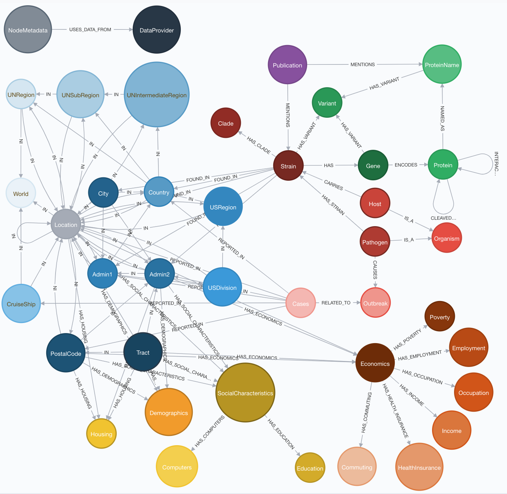
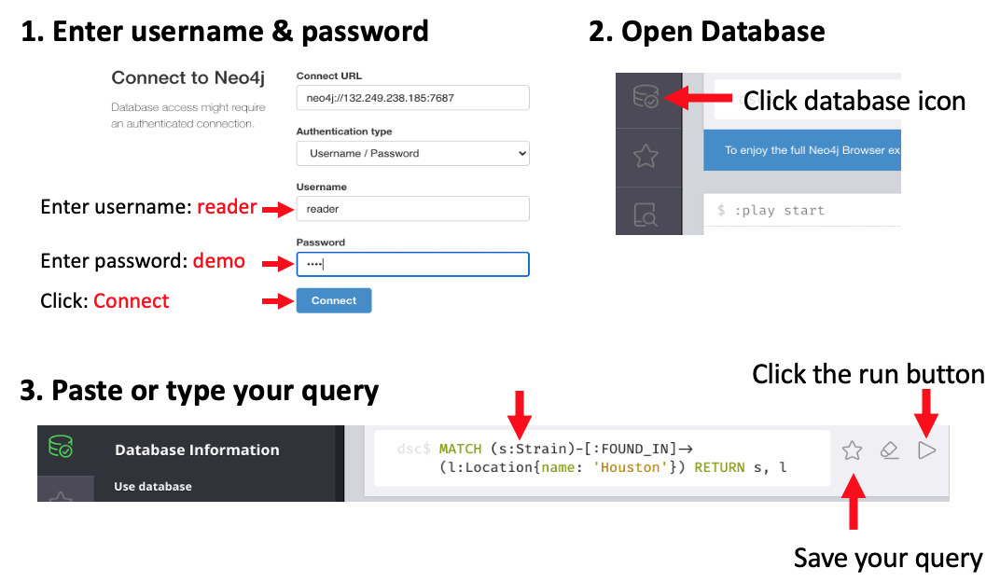
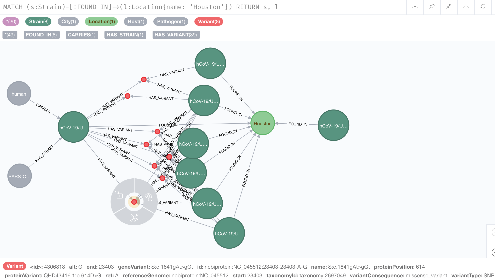
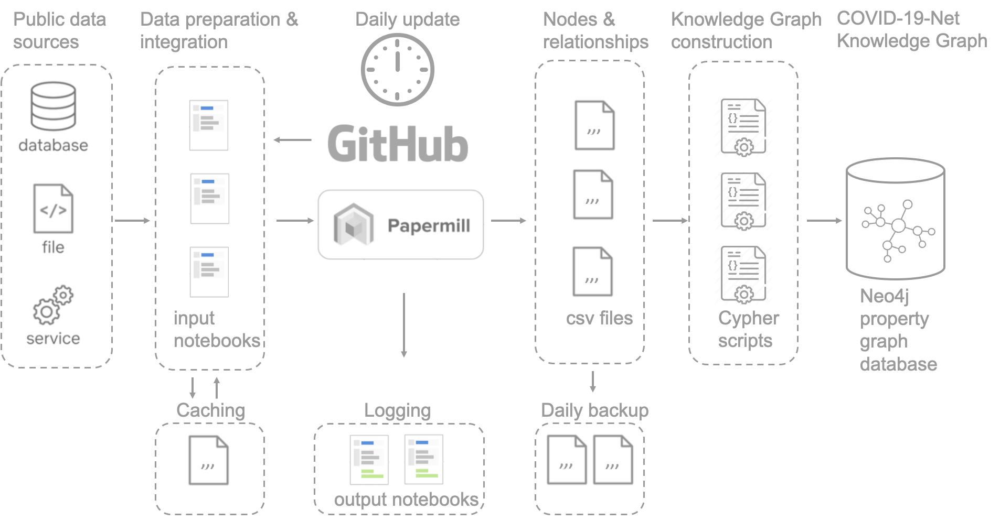
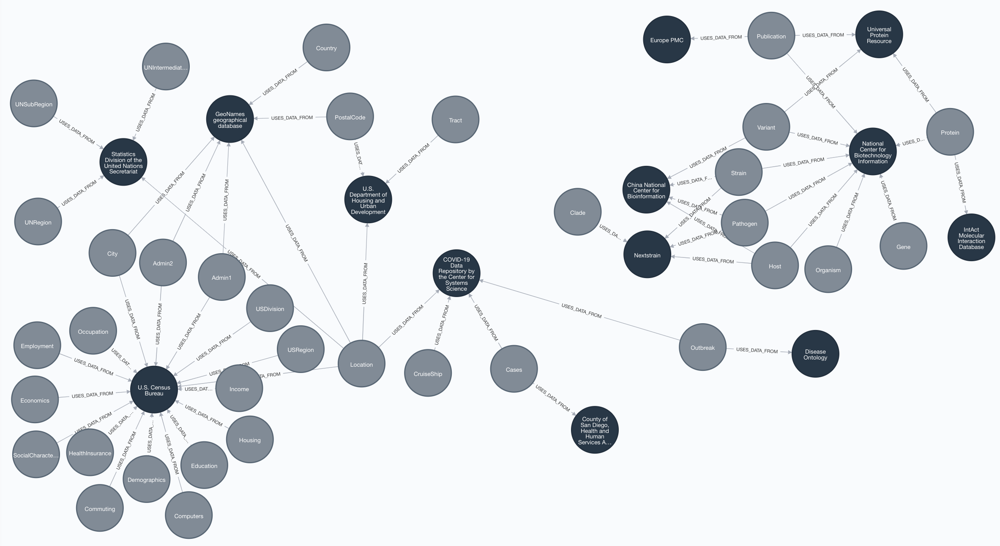

# Covid-19-Community

This project is a community effort to build a Neo4j Knowledge Graph (KG) that integrates heterogeneous biomedical and environmental [datasets](reference_data/DataProvider.csv) to help researchers analyze the interplay between host, pathogen, the environment, and COVID-19.

<p align="center">

</p>

## Knowledge Graph Schema



**COVID-19-Net Knowledge Graph :** This schema shows the Nodes (circles) and their Relationships (arrows) of the COVID-19-Net KG.  The knowledge graph integrates the following types of data: 1. geographic locations (blue), 2. epidemiologic data (red), 3. biological data (green), 4. population characteristics (yellow and orange). The [NodeMetadata](reference_data/NodeMetadata.csv) node describes nodes and refers to relevant ontologies (e.g., Infectious Disease Ontology) and [DataProvider](reference_data/DataProvider.csv) node refers to the [origin of the data](https://github.com/covid-19-net/covid-19-community#data-providers).

<p align="center">

</p>

**Location Subgraph:** This subgraph represents the geographic hierarchy from the world to the city level (population > 1000), as well as PostalCode (US ZIP) and US Census Tract level. Each geographic node has a **Location** label (not shown), to simplify finding locations without specifying a specific level in the geographic hierarchy.

<p align="center">

</p>

**Epidemiology Subgraph:** This subgraph represents COVID-19 cases including information about viral strains, and the pathogen and host organism. Cases and Strains are linked to the locations where they were reported and found, respectively.

<p align="center">

</p>

**Biology Subgraph:** This subgraph represents gene, variant, protein, pathogen-host protein-protein interactions, and links to publications.

<p align="center">

</p>

**Population Characteristics Subgraph:** This subgraph represents data from the American Community Survey 2018 5-year estimates. Selected population characteristics that may be risk factors for COVID-19 infections have been included. These data are currently available at three geographic levels: US Counties (Admin2), US ZIP Codes (PostalCode), and US Census Tract (Tract).


Note, this KG is work in progress and changes frequently.

## Browse the Knowledge Graph with the Neo4j Browser

**The Knowledge Graph is updated daily between 07:00 and 08:00 UTC.**


View of Neo4j Browser showing the result of a query about interactions of the Spike glycoprotein with human host proteins and related publications in PubMedCentral.

You can browse the Knowledge Graph here (click the launch button and follow the instructions below)

[](http://132.249.238.185:7474/)



### Run a Full-text Query
The KG can be searched by `locations` (geographic locations and cruise ship names) and `bioentities` (proteins, genes, strains, organisms) using a full-text search. The results contain exact and approximate matches.

#### Example full-text query: find spike proteins
***Query:***
```
CALL db.index.fulltext.queryNodes("bioentities", "spike") YIELD node
```

***Result:***

<p align="center">

</p>

This subgraph shows the results of the full-text search. Five proteins contain the word `Spike`. Each protein is associated with one or more protein names (synonymes) (only one name is shown here). The Spike glycoprotein in the center is the full-length gene product encoded by the SARS-CoV-2 S gene. The other four proteins are cleavage products (fragments) of the full-length protein.

#### Example full-text query: find spike proteins - tabular results
The following query returns the names of the matched bioentities and the labels of the nodes (e.g., Protein, ProteinName) sorted by the match score in descending order.

***Query:***
```
CALL db.index.fulltext.queryNodes("bioentities", "spike") YIELD node, score
RETURN node.name, labels(node), score
```

***Result:***

<p align="center">

</p>


### Run a Cypher Query

Specific Nodes and Relationships in the KG can be searched using the [Cypher query language](https://neo4j.com/docs/cypher-manual/current/introduction/).

#### Example Cypher query: find viral strains collected in Houston

***Query:***
```
MATCH (s:Strain)-[:FOUND_IN]->(l:Location{name: 'Houston'}) RETURN s, l
```

***Result:***


This subgraph shows viral strains (green) of the [SARS-CoV-2 virus](https://www.ncbi.nlm.nih.gov/Taxonomy/Browser/wwwtax.cgi?id=2697049) carried by [human](https://www.ncbi.nlm.nih.gov/Taxonomy/Browser/wwwtax.cgi?id=9606) hosts in Houston (organisms in gray). The strains have several variants (e.g., mutations)(red) in common. Details of the high-lighted variant is shown at the bottom. This variant is a [missense mutation](https://en.wikipedia.org/wiki/Missense_mutation) in the S gene (S:c.1841gAt>gGt): the base "A" ([Adenosine](https://en.wikipedia.org/wiki/adenosine)) found in the Wuhan-Hu-1 reference genome [NC_45512](https://www.ncbi.nlm.nih.gov/nuccore/NC_045512) was mutated to a "G" ([Guanine](https://en.wikipedia.org/wiki/guanine)) at position 23403, resulting in the encoded Spike glycoprotein ([QHD43416](https://www.ncbi.nlm.nih.gov/protein/QHD43416.1)) to be changed from a "D" ([Aspartic acid](https://en.wikipedia.org/wiki/Aspartic_acid)) to a "G" ([Glycine](https://en.wikipedia.org/wiki/Glycine)) amino acid at position 614 (QHD43416.1:p.614D>G).

#### Example Cypher query: aggregate cummulative COVID-19 case numbers at the US state (Admin1) level

***Query:***
```
MATCH (o:Outbreak{id: "COVID-19"})<-[:RELATED_TO]-(c:Cases{date: date("2020-07-06")})-[:REPORTED_IN]->(a:Admin2)-[:IN]->(a1:Admin1)
RETURN a1.name as state, sum(c.cummulativeConfirmed) as confirmedCases, sum(c.cummulativeDeaths) as deaths
ORDER BY confirmedCases DESC;
```

***Result:***

<p align="center">

</p>

Note, some cases in the COVID-19 Data Repository by Johns Hopkins University cannot be mapped to a county or state location (e.g., correctional facilities, missing location data). Therefore, the results of this query will underreport the actual number of cases.

## Query the Knowledge Graph in Jupyter Notebook
Cypher queries can be run in Jupyter Notebooks to enable reproducible data analyses and visualizations.

You can run the following Jupyter Notebooks in your web browser:

[](https://aws-uswest2-binder.pangeo.io/v2/gh/covid-19-net/covid-19-community/master?urlpath=lab)

Once Jupyter Lab launches, navigate to the `notebooks/queries` directory and run the following notebooks:

|Notebook|Description|
|:-------|:----------|
|[CaseCounts](notebooks/queries/CaseCounts.ipynb)| Runs example queries for case counts|
|[Locations](notebooks/queries/Locations.ipynb)| Runs example queries for locations|
|[Demographics](notebooks/queries/Demographics.ipynb)| Runs example queries for demographics data from the American Community Survey|
|[SocialCharacteristics](notebooks/queries/SocialCharacteristics.ipynb)| Runs example queries for social characteristics from the American Community Survey|
|[EconomicCharacteristics](notebooks/queries/EconomicCharacteristics.ipynb)| Runs example queries for economic characteristics from the American Community Survey|
|[Housing](notebooks/queries/Housing.ipynb)| Runs example queries for housing characteristics from the American Community Survey|
|[Bioentities](notebooks/queries/Bioentities.ipynb)| Runs example queries for bioentities|
|[AnalyzeVariantsSpikeGlycoprotein](notebooks/analyses/AnalyzeVariantsSpikeGlycoprotein.ipynb)| Analyze SARS-CoV-2 Spike Glycoprotein Variants|
|[RiskFactorsByStateCounty](notebooks/analyses/RiskFactorsByStateCounty.ipynb)| Explore Risk Factors for COVID-19 for Counties in US States|
|[RiskFactorsSanDiegoCounty](notebooks/analyses/RiskFactorsSanDiegoCounty.ipynb)| Explore Risk Factors for COVID-19 for San Diego County|
|...|add examples here ...|

## Data Download, Preparation, and Integration


COVID-19-Net Knowledge Graph is created from publically available resources, including databases, files, and web services. A reproducible workflow, defined in this repository, is used to run a daily update of the knowledge graph. The Jupyter notebooks listed in the table below download, clean, standardize, and integrate data in the form of .csv files for ingestion into the Knowledge Graph. The prepared data files are saved in the `NEO4J_HOME/import` directory and cached intermediate files are saved in the `NEO4J_HOME/import/cache` directory. These notebooks are run daily at 07:00 UTC in batch using [Papermill](https://netflixtechblog.com/scheduling-notebooks-348e6c14cfd6#:~:text=What%20Papermill%20does%20is%20rather,to%20an%20isolated%20output%20notebook.&text=Papermill%20enables%20a%20paradigm%20change%20in%20how%20you%20work%20with%20notebook%20documents) with the [update script](scripts/update_kg.sh) to download the latest data and update the Knowlege Graph.


|Notebook|Description|
|:-------|:----------|
|[00e-GeoNamesCountry](notebooks/dataprep/00e-GeoNamesCountry.ipynb)| Downloads country information from GeoNames.org|
|[00f-GeoNamesAdmin1](notebooks/dataprep/00f-GeoNamesAdmin1.ipynb)| Downloads first administrative divisions (State, Province, Municipality) information from GeoNames.org|
|[00g-GeoNamesAdmin2](notebooks/dataprep/00g-GeoNamesAdmin2.ipynb)| Downloads second administrative divisions (Counties in the US) information from GeoNames.org|
|[00h-GeoNamesCity](notebooks/dataprep/00h-GeoNamesCity.ipynb)| Downloads city information (population > 1000) from GeoNames.org|
|[00i-USCensusRegionDivisionState2017](notebooks/dataprep/00i-USCensusRegionDivisionState2017.ipynb)| Downloads US regions, divisions, and assigns state FIPS codes from the US Census Bureau|
|[00j-USCensusCountyCity2017](notebooks/dataprep/00j-USCensusCountyCity2017.ipynb)| Downloads US County FIPS codes from the US Census Bureau|
|[00k-UNRegion](notebooks/dataprep/00k-UNRegion.ipynb)| Downloads UN geographic regions, subregions, and intermediate region information from United Nations|
|[00n-Geolocation](notebooks/dataprep/00n-Geolocation.ipynb)| Downloads longitude, latitude, elevation, and population data from GeoNames.org|
|[01a-NCBIStrain](notebooks/dataprep/01a-NCBIStrain.ipynb)| Downloads the SARS-CoV-2 strain data from NCBI |
|[01b-Nextstrain](notebooks/dataprep/01b-Nextstrain.ipynb)| Downloads the SARS-CoV-2 strain metadata from Nextstrain|
|[01c-NCBIRefSeq](notebooks/dataprep/01c-NCBIRefSeq.ipynb)| Downloads the SARS-CoV-2 reference genome, genes, and protein products from NCBI|
|[01d-CNCBStrain](notebooks/dataprep/01d-CNCBStrain.ipynb)| Downloads SARS-CoV-2 viral strains and variation data from CNCB (China National Center for Bioinformation) [takes about 12 hours to run the first time, results are cached]|
|[01d-CNCBStrainLocations](notebooks/dataprep/01d-CNCBStrainLocations.ipynb)| Standardizes locations for variation data from CNCB (China National Center for Bioinformation) |
|[01e-ProteinProteinInteraction](notebooks/dataprep/01e-ProteinProteinInteraction.ipynb)| Downloads SARS-CoV-2 - human protein interaction data from IntAct|
|[01h-PMCAccession](notebooks/dataprep/01h-PMCAccession.ipynb)| Downloads PubMed Central articles that mention NCBI and GISAID strains|
|[02a-JHUCases](notebooks/dataprep/02a-JHUCases.ipynb)| Downloads cummulative confimed cases and deaths from the COVID-19 Data Repository by Johns Hopkins University|
|[02a-JHUCasesLocation](notebooks/dataprep/02a-JHUCasesLocation.ipynb)| Standardizes location data for the COVID-19 Data Repository by Johns Hopkins University|
|[02c-SDHHSACases](notebooks/dataprep/02c-SDHHSACases.ipynb)| Downloads cummulative confirmed COVID-19 cases from the County of San Diego, Health and Human Services Agency|
|[03a-USCensusDP02Education](notebooks/dataprep/03a-USCensusDP02Education.ipynb)| Downloads social characteristics (DP02) from the American Community Survey 5-Year Data 2018|
|[03a-USCensusDP02Computers](notebooks/dataprep/03a-USCensusDP02Computers.ipynb)| Downloads social characteristics (DP02) from the American Community Survey 5-Year Data 2018|
|[03a-USCensusDP03Commuting](notebooks/dataprep/03a-USCensusDP03Commuting.ipynb)| Downloads economic characteristics (DP03) from the American Community Survey 5-Year Data 2018|
|[03a-USCensusDP03Employment](notebooks/dataprep/03a-USCensusDP03Employment.ipynb)| Downloads economic characteristics (DP03) from the American Community Survey 5-Year Data 2018|
|[03a-USCensusDP03HealthInsurance](notebooks/dataprep/03a-USCensusDP03HealthInsurance.ipynb)| Downloads economic characteristics (DP03) from the American Community Survey 5-Year Data 2018|
|[03a-USCensusDP03Income](notebooks/dataprep/03a-USCensusDP03Income.ipynb)| Downloads economic characteristics (DP03) from the American Community Survey 5-Year Data 2018|
|[03a-USCensusDP03Income](notebooks/dataprep/03a-USCensusDP03Income.ipynb)| Downloads economic characteristics (DP03) from the American Community Survey 5-Year Data 2018|
|[03a-USCensusDP03Occupation](notebooks/dataprep/03a-USCensusDP03Occupation.ipynb)| Downloads economic characteristics (DP03) from the American Community Survey 5-Year Data 2018|
|[03a-USCensusDP03Poverty](notebooks/dataprep/03a-USCensusDP03Poverty.ipynb)| Downloads economic characteristics (DP03) from the American Community Survey 5-Year Data 2018|
|[03a-USCensusDP04](notebooks/dataprep/03a-USCensusDP05.ipynb)| Downloads housing (DP04) from the American Community Survey 5-Year Data 2018|
|[03a-USCensusDP05](notebooks/dataprep/03a-USCensusDP05.ipynb)| Downloads demographic data estimates (DP05) from the American Community Survey 5-Year Data 2018|
|...|Future notebooks that add new data to the knowledge graph|

## How to run Jupyter Notebook Examples locally

**1. Fork this project**

A [fork](https://help.github.com/en/articles/fork-a-repo) is a copy of a repository in your GitHub account. Forking a repository allows you to freely experiment with changes without affecting the original project.

In the top-right corner of this GitHub page, click ```Fork```.

Then, download all materials to your laptop by cloning your copy of the repository, where ```your-user-name``` is your GitHub user name. To clone the repository from a Terminal window or the Anaconda prompt (Windows), run:

```
git clone https://github.com/your-user-name/covid-19-community.git
cd covid-19-community
```

**2. Create a conda environment**

The file `environment.yml` specifies the Python version and all packages required by the tutorial. 
```
conda env create -f environment.yml
```

Activate the conda environment
```
conda activate covid-19-community
```

Install Jupyter Lab extension
```
jupyter labextension install @jupyter-widgets/jupyterlab-manager
```

**3. Launch Jupyter Lab**
```
jupyter lab
```

Navigate to the [`notebooks/queries`](notebooks/queries/) directory to run the example Jupyter Notebooks.

## How to run the Data Download and Preparation steps locally

Note, the following steps have been implemented for MacOS and Linux only. 

Some steps will take a very long time, e.g., notebook [01d-CNCBStrain](notebooks/dataprep/01d-CNCBStrain.ipynb) may take more than 12 hours to run the first time.

Follow steps 1. - 3. from above.

**4. Install Neo4j Desktop**

[Download Neo4j](https://neo4j.com/download/)

Then, launch the Neo4j Browser, create an empty database, set the password to "neo4jbinder", and close the database.

**5. Set Environment Variable**

Add the environment variable `NEO4J_HOME` with the path to the Neo4j database installation to your .bash_profile file, e.g.

`export NEO4J_HOME="/Users/username/Library/Application Support/Neo4j Desktop/Application/neo4jDatabases/database-.../installation-4.0.3"`

Add the environment variable `NEO4J_IMPORT` with the path to the Neo4j database import directory to your .bash_profile file, e.g.


`export NEO4J_IMPORT="/Users/username/Library/Application Support/Neo4j Desktop/Application/neo4jDatabases/database-.../installation-4.0.3/import"`

**6. Run Data Download Notebooks**

Start Jupyter Lab.
```
jupyter lab
```
Navigate to the (`notebooks/dataprep/`) directory and run all notebooks in alphabetical order to download, clean, standardize and save the data in the `NEO4J_HOME/import` directory for ingestion into the Neo4j database.

**7. Upload Data into a Local Neo4j Database**

Afer all data files have been created in step 6, run (`notebooks/local/2-CreateKGLocal.ipynb` to import the data into your local Neo4j database. Make sure the Neo4j Browser is closed before running the database import!

**8. Browse local KG in Neo4j Browser**

After step 7 has completed, start the database in the Neo4j Browser to interactively explore the KG or run local queries.

## How can you contribute?

* File an [issue](https://github.com/covid-19-net/covid-19-community/issues/new) to discuss your idea so we can coordinate efforts
* Help with [specific issues](https://github.com/covid-19-net/covid-19-community/labels/help%20wanted)
* Suggest publically accessible data sets
* Add Jupyter Notebooks with data analyses, maps, and visualizations
* Report bugs or issues

## Citation
Peter W. Rose, David Valentine, Ilya Zaslavsky, COVID-19-Net: Integrating Health, Pathogen and Environmental Data into a Knowledge Graph for Case Tracking, Analysis, and Forecasting. Available online: https://github.com/covid-19-net/covid-19-community (2020).

Please also cite the [data providers](reference_data/DataProvider.csv).

## Data Providers
The schema below shows how data sources are integrated into the nodes of the Knowledge Graph.



## Acknowledgements
Neo4j provided technical support and organized the community development: "GraphHackers, Let’s Unite to Help Save the World — [Graphs4Good 2020](https://medium.com/neo4j/graphhackers-lets-unite-to-help-save-the-world-graphs4good-2020-fed53562b41f)".

Students of the UCSD Spatial Data Science course [DSC-198](https://sites.google.com/view/dsc198spring20/syllabus): EXPLORING COVID-19 PANDEMIC WITH DATA SCIENCE

Contributors:
Kaushik Ganapathy, Braden Riggs, Eric Yu

Project KONQUER team members at UC San Diego and UTHealth at Houston.

## Funding
Development of this prototype is in part supported by the National Science Foundation under Award Numbers:

**NSF Convergence Accelerator Phase I (RAISE):** Knowledge Open Network Queries for Research (KONQUER) ([1937136](https://www.nsf.gov/awardsearch/showAward?AWD_ID=1937136))

**NSF RAPID:** COVID-19-Net: Integrating Health, Pathogen and Environmental Data into a Knowledge Graph for Case Tracking, Analysis, and Forecasting ([2028411](https://www.nsf.gov/awardsearch/showAward?AWD_ID=2028411))


